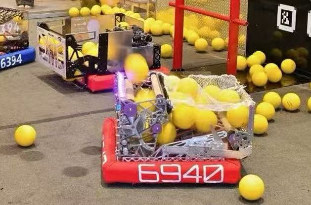

# 2026 Rebuilt — FRC 机器人代码

[English](README.md)

Team 6940 的 2026 FIRST Robotics Competition 赛季 **REBUILT** **季后赛**机器人代码。

<p align="center">
  
</p>

## 概述

这是一个 Java 17 WPILib 项目，使用 **Command-Based** 框架，集成 **AdvantageKit** 日志与回放系统。机器人搭载 **SDS Mk5n** 底盘、over-the-bumper intake（Motion Magic 齿条定位）、全宽 shooter，以及融合 Limelight + PhotonVision 视觉管线（实验性）。

## 项目结构

```
src/main/java/frc/robot/
├── Main.java                          # 入口
├── Robot.java                         # LoggedRobot — 模式分发 (REAL/SIM/REPLAY)
├── RobotContainer.java                # 子系统实例化、按键绑定、自动选择器
├── Constants.java                     # 所有调参常量、场地几何、电机 ID
├── Telemetry.java                     # 麦轮模块遥测 → NetworkTables + SignalLogger
├── BuildConstants.java                # 自动生成的构建元数据（勿手动编辑）
├── generated/
│   └── TunerConstants.java            # Phoenix 6 Tuner 自动生成（勿手动编辑）
├── commands/                          # 所有命令
│   ├── Autos/                         # 自动例程（基于 PathPlanner）
│   ├── DriveDefaultCommand.java       # 遥控麦轮驱动
│   ├── DriveHybridTrenchCommand.java  # Trench 驾驶辅助
│   ├── IntakeHybridCommand.java       # LT intake，长按切换 hybrid
│   ├── HybridScoreCommand.java        # Hub 得分：AIM → READY → SHOOT
│   ├── HybridPassCommand.java         # 传球通道射击
│   ├── ManualShootCommand.java        # SmartDashboard 调参射击
│   ├── HeatupCommand.java             # Shooter 预转
│   └── leds/LEDDefaultCommand.java    # LED 状态机
├── subsystems/
│   ├── SuperStructure.java            # 中央模式协调器 (DriveMode, ControlMode, ShootPhase, IntakeMode)
│   ├── Chassis/
│   │   ├── CommandSwerveDrivetrain.java  # SDS Mk5n swerve + PathPlanner + Trench 辅助
│   │   ├── SwerveDriveIO.java            # AdvantageKit IO 接口
│   │   ├── TrenchLane.java               # Trench 中心线路径枚举
│   │   └── HybridTrenchReference.java    # Trench 引导数学
│   ├── Intake/                        # Over-the-bumper intake: 齿条 (Motion Magic) + 双滚轮
│   ├── Shooter/                       # 全宽后方 dumper shooter
│   ├── Hood/                          # 单电机，Motion Magic 位置控制
│   ├── Indexer/                       # Feeder + indexer 滚轮，堵转检测
│   ├── Vision/                        # Limelight MegaTag2 + PhotonVision 融合（实验性）
│   ├── Halo/LEDController.java        # 可寻址 LED 灯带，分层动画
│   ├── Power/PowerMonitor.java        # 集中式电流/功率日志
│   └── GamePeriodReminder.java        # 比赛时段提醒
├── simulation/
│   └── FieldSimulation.java           # Maple-sim 场地物理仿真 (intake, hopper, dumper shooter)
├── util/                              # 数学工具、插值、PathPlanner AD*
└── Library/                           # 社区代码 (team 95, 1323, 1678, 1706, 2910, 3476, 503, 6940)
```

## 架构

### IO 抽象模式

每个硬件子系统遵循相同的模式，实现干净的仿真/回放支持：

| 层级 | 用途 | 示例 |
|------|------|------|
| `*IO` 接口 | 定义所有硬件读写 + `@AutoLog` 输入 | `IntakeIO` |
| `*IOPhoenix6` | 真实 CTRE Phoenix 6 硬件实现 | `IntakeIOPhoenix6` |
| `*IOSim` | Maple-sim 物理仿真 | `IntakeIOSim` |

子系统在构造时根据 `Constants.currentMode` 选择实现：

```java
if (Constants.currentMode == Mode.REAL)      io = new IntakeIOPhoenix6();
else if (Constants.currentMode == Mode.SIM)  io = new IntakeIOSim();
else                                         io = new IntakeIO() {};  // 回放：空操作
```

### SuperStructure — 中央模式协调器

`SuperStructure` 是机器人的模式中枢。命令通过四个枚举进行读写：

| 枚举 | 值 | 用途 |
|------|------|------|
| `DriveMode` | `AUTO_AIM`, `HYBRID_TRENCH`, `HYBRID_INTAKE_DRIVE`, `MANUAL` | 驱动控制优先级 |
| `ControlMode` | `SCORE`, `PASS`, `MANUAL` | 射击目标选择 |
| `ShootPhase` | `OFF`, `HEATUP`, `AIM`, `READY`, `SHOOT` | 射击序列状态 |
| `IntakeMode` | `INTAKE`, `HYBRID`, `RETRACTED`, `OFF`, `REVERSE`, `MID` | Intake 齿条位置 |

驱动模式优先级（高者胜出）：`AutoAim` > `HybridTrench` > `HybridIntake` > `Manual`。

### 射击流水线

Shooter 使用运动补偿弹道解算器（`ProjectileCalculator`）：

1. **HEATUP** — 预转 shooter 飞轮至目标转速
2. **AIM** — 自动瞄准底盘航向至 hub 中心；根据距离查表设置 hood 角度
3. **READY** — 所有子系统在容差范围内（航向、hood、shooter RPM）
4. **SHOOT** — 锁定底盘，indexer 送球，然后收回 intake

两种射击模式：**SCORE**（hub 中心，全速）和 **PASS**（传球通道，低速 + 飞行时间补偿）。操作员可通过手柄按键微调 RPS（B/A/X/Y = -1/-2/+1/+2）。

#### 可切换动射解算

`ProjectileCalculator` 提供两种弹道模式，可在每个射击命令中切换。动射解算方法改编自 **Team 6328 (Mechanical Advantage)**。

| 模式 | 方法 | 行为 |
|------|------|------|
| **动射解算** | `planScore()` / `planPass()` | 迭代 20 次前瞻：计算虚拟目标偏移 `fieldVelocity * flightTime`，使弹丸在底盘运动下仍命中真实目标。日志标记 `usesMotionSolver = true`。 |
| **固定位置** | `planFixScore()` / `planManual()` | 基于 `InterpolatingDoubleTreeMap` 的静态距离查表。无速度补偿。日志标记 `usesMotionSolver = false`。 |

当前 `HybridScoreCommand` 使用固定位置模式（动射解算路径已注释但可用），而 `HybridPassCommand` 始终使用动射解算——传球射击需要速度补偿，因为机器人通常在高速行驶。两种模式共享相同的距离查表，但使用各自的数据集（`DistanceToShooterRps` vs `PassDistanceToShooterRps`）。

### Hybrid Trench — 驾驶辅助

Trench 驱动（`CommandSwerveDrivetrain.driveHybridTrench()`）是一个共享控制系统，将驾驶员摇杆输入与 PathPlanner 路径引导混合：

1. **路径选择** — 启动时加载两条 Trench 中心线样条（`ATLtoNTL`、`ATRtoNTR`）。根据机器人位置自动选择最近的车道。路径自动根据红蓝联盟和机器人所在半场翻转。

2. **前瞻引导** — 找到路径上最近点，然后采样前方 0.6 m 的前瞻点（可通过 `TrenchLookAheadMeters` 配置）。引导向量从机器人指向前瞻点。

3. **驾驶混合** — 驾驶员摇杆速度与引导向量混合。横向距离控制粘附度：在路径上时引导主导；远离路径时驾驶员意图主导。粘附度遵循 sqrt 曲线（`TrenchBlendExponent = 0.5`）实现平滑衰减。

4. **方向推断** — 系统从驾驶员意图推断行进方向（摇杆场地速度与路径切线的点积）。无需额外按键切换方向——推摇杆方向即行进方向。

5. **航向保持** — 当 `IntakeMode` 为 `HYBRID` 时，底盘自动对齐最近的 Trench 方边（20 度滞后防振荡）。右摇杆可覆盖手动航向。基于余弦的线性减速（`kLiner = cos(headingError)`）在航向修正时自然减速。

6. **激活方式** — 驾驶员按住 A 进入 Trench 模式。Trench 模式下 RT 激活 `IntakeMode.HYBRID` 实现边开边收。速度限制在最大速度的 60%。

### ChassisMode — 电流限制配置

由 `SuperStructure` 管理的三种配置：

| 模式 | 驱动供电 | 转向供电 | 用途 |
|------|---------|---------|------|
| NORMAL | 60A | 50A | 默认驾驶 |
| SHOOTING | 20A | 25A | 为 shooter 释放电池 |
| ATTACKMODE | 无限制 | 无限制 | 全功率（10 秒超时） |

### 视觉融合（实验性）

融合两个视觉源，使用逆方差加权：

- **Limelight** — MegaTag2 位姿估计，硬件报告标准差
- **PhotonVision** — AprilTag 检测，基于目标面积的 sigma 插值

拒绝门限：最大距离、过期数据、高角速度、最小目标面积。Hub 标签优先于 Trench 标签以提高得分精度。

## 仿真

桌面仿真使用 **maple-sim** 进行物理仿真：

- 麦轮驱动碰撞体，可配置质量（74 kg）、转动惯量、轮胎摩擦系数
- Over-the-bumper intake 仿真（前装，可配置宽度/伸出量）
- 全宽后方 dumper shooter，平行弹道通道
- 场地生成弹丸对象用于 intake 测试

切换仿真和日志回放，修改 `Constants.simMode`：

```java
public static final Mode simMode = Mode.SIM;     // 物理仿真
public static final Mode simMode = Mode.REPLAY;  // 从 .wpilog 文件回放
```

## 自动

9 条自动例程，基于 **PathPlannerLib**，通过 SmartDashboard 选择：

| 例程 | 描述 |
|------|------|
| `RightDoubleSwipe` | 右侧出发，两次 intake-得分循环 |
| `RightDoubleSwipeOverMid` | 右侧出发，穿越中场进行第二次 intake |
| `RightDoubleSwipeTrench` | 右侧出发，使用 Trench 车道进行第二次 intake |
| `LeftDoubleSwipe` | 左侧出发，右侧镜像 |
| `LeftDoubleSwipeOverMid` | 左侧出发，穿越中场 |
| `LeftDoubleSwipeTrench` | 左侧出发，使用 Trench 车道 |
| `LeftDepot` | 左侧出发，depot 拾取 |
| `LeftDepotSingleSwipe` | 左侧出发，depot + 单次扫取 |

所有例程支持通过 `SmartDashboard/Auto Delay` 设置延迟，以及联盟颜色自动翻转。

## 供应商库

| 库 | 版本 | 用途 |
|----|------|------|
| AdvantageKit | 26.0.2 | 日志、回放、`@AutoLog` 注解处理器 |
| Phoenix 6 | 26.3.0 | CTRE TalonFX 电机控制器、Pigeon IMU |
| PathPlannerLib | 2026.1.2 | 自动路径跟随 + 寻路 |
| PhotonLib | — | PhotonVision AprilTag 检测 |
| ChoreoLib | 2026 | 编舞支持 |
| maple-sim | — | 物理仿真框架 |
| Studica | — | NavX IMU 支持 |
| URCL | — | 通用机器人控制库 |
| libgrapplefrc2026 | — | Grapple FRC 工具 |
| WPILibNewCommands | — | Command-Based 框架 |

## 配置

`Constants.java` 中的关键常量：

- `simMode` — `Mode.SIM`（物理仿真）或 `Mode.REPLAY`（日志回放）
- `enableNtTelemetry` — 比赛时设为 `false` 以避免 NT4 发布延迟
- `MotorIDs` — 底盘、intake、shooter、hood、indexer 的所有 CAN ID
- `FieldConstants` — AprilTag 布局、hub 几何、Trench/bump 尺寸
- `ProjectileConstants` — 距离到 RPS 和距离到 hood 的查表

AprilTag 场地布局加载自 `src/main/deploy/pathplanner/field2026/2026-official-andymark.json`。

## 遥测

- **AdvantageKit** — 完整机器人状态日志写入 `.wpilog` 文件（roboRIO 上写 USB，本地写 `logs/` 目录）
- **NetworkTables** — 实时遥测到 AdvantageScope / Elastic 仪表盘（可选，由 `enableNtTelemetry` 控制）
- **SignalLogger** — CTRE Phoenix 6 原生日志，记录麦轮模块状态
- **PowerMonitor** — 汇总每个子系统的电流和功率，输出到 `Power/Subsystems/*`

## 测试

JUnit 5，自动检测已启用。桌面仿真支持（`includeDesktopSupport = true`）允许 IO sim 类在无硬件环境下运行。

```bash
./gradlew test
```

## 贡献

1. 从 `master` 创建自己的分支
2. 进行修改并本地测试（`./gradlew simRun` 或 `./gradlew test`）
3. 向 `master` 提交 Pull Request —— 切勿直接推送到 `master`

## 致谢

本项目包含以下 FRC 队伍的工具代码：

- **Team 95** — 麦轮运动学改进
- **Team 1323** — HSV 颜色转换、移动平均
- **Team 1678** — CTRE 模块状态优化、单位转换
- **Team 1706** — 场地相对速度/加速度、线性插值
- **Team 2910** — 数学工具、PID 控制、插值映射
- **Team 3476** — 时间戳位姿跟踪、实时可编辑值
- **Team 503** — 插值树映射
- **Team 6328** — 运动补偿弹道解算器
- **Team 6940** — 轨迹工具

## 许可证

本项目基于 **WPILib License**（BSD 风格）授权。参见 [WPILib-License.md](WPILib-License.md)。

AdvantageKit 基于 GPL-3.0 授权。参见 [AdvantageKit-License.md](AdvantageKit-License.md)。